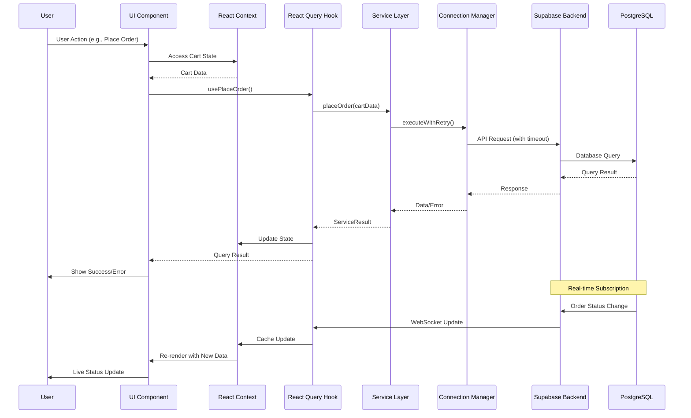
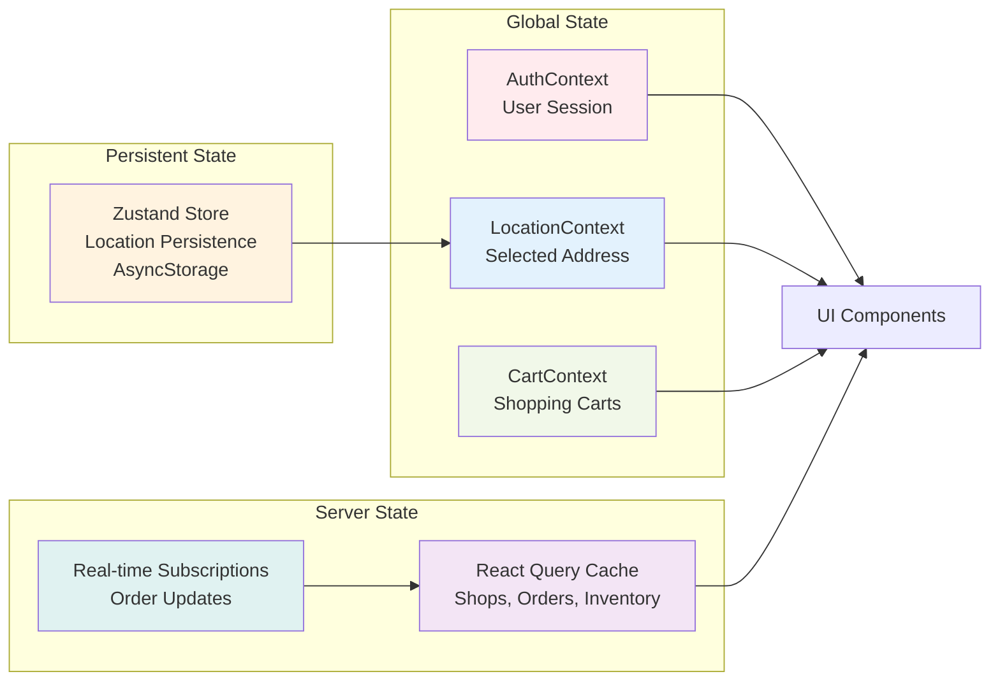
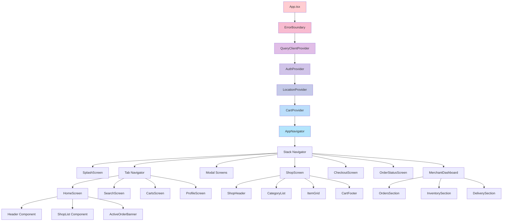
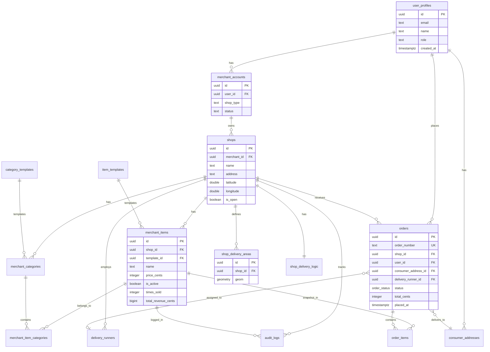

Github Link : https://github.com/ar162387/AroundYouFYP.git


🧩 Overview

AroundYouFYP is a feature-rich React Native framework designed for building scalable, location-aware mobile applications.
It combines robust architecture, native styling, and comprehensive backend integration to accelerate development and deliver a seamless user experience.

✨ Core Features

🧱 Modular Architecture – Includes global state management, error handling, and optimized data fetching strategies.
🎨 NativeWind & Tailwind CSS – Ensures consistent, scalable, and theme-ready UI design.
📍 Location & Map Services – Custom hooks and components for geospatial logic, delivery zones, and dynamic rendering.
🛒 Inventory & Order Management – Complete system for products, orders, and merchant workflows.
🔌 Backend Integration – Supabase-backed schemas and API services ensuring data reliability and scalability.
⚙️ Developer Tools – Type safety, skeleton loaders, charts, and testing utilities for smoother development cycles.


# AroundYou - System Architecture Documentation

**Version:** 1.0.0  
**Last Updated:** 2024  
**Author:** System Architecture Analysis

---

## Table of Contents

1. [Executive Summary](#executive-summary)
2. [System Overview](#system-overview)
3. [Technology Stack](#technology-stack)
4. [Architecture Layers](#architecture-layers)
5. [Data Flow & State Management](#data-flow--state-management)
6. [Key Components](#key-components)
7. [Database Architecture](#database-architecture)
8. [Design Patterns & Conventions](#design-patterns--conventions)
9. [Consistency Analysis](#consistency-analysis)
10. [Security Architecture](#security-architecture)
11. [Performance Considerations](#performance-considerations)
12. [Recommendations & Improvements](#recommendations--improvements)

---

## Executive Summary

**AroundYou** is a location-aware, dual-role (consumer/merchant) mobile application built with React Native. The system enables consumers to discover nearby shops, manage multi-shop carts, place orders, and track deliveries in real-time. Merchants can manage shops, inventory, delivery zones, orders, and runners.

### Key Architectural Highlights

- **Hybrid State Management**: React Context for global state, Zustand for location persistence, React Query for server state
- **Real-time Capabilities**: Supabase Realtime subscriptions for live order updates
- **Geospatial Features**: PostGIS for delivery zone management and shop discovery
- **Modular Service Layer**: Clear separation between consumer and merchant services
- **Type-Safe Architecture**: Comprehensive TypeScript types throughout
- **Connection Resilience**: Custom connection manager for handling stale HTTP connections

---

## System Architecture Diagram

```mermaid
graph TB
    subgraph "Mobile Application (React Native)"
        subgraph "Presentation Layer"
            UI[UI Components & Screens]
            NAV[Navigation Stack]
            ERR[Error Boundary]
        end
        
        subgraph "State Management Layer"
            CTX[React Context API<br/>AuthContext<br/>LocationContext<br/>CartContext]
            ZST[Zustand Store<br/>Location Persistence]
            RQ[React Query<br/>Server State Cache]
        end
        
        subgraph "Service Layer"
            AUTH_SVC[Auth Service]
            CONSUMER_SVC[Consumer Services<br/>Shop, Order, Address, Cart]
            MERCHANT_SVC[Merchant Services<br/>Shop, Inventory, Order, Delivery]
        end
        
        subgraph "Data Access Layer"
            CONN_MGR[Connection Manager<br/>Timeout & Retry Logic]
            SUPABASE_CLIENT[Supabase Client]
        end
    end
    
    subgraph "Backend Services (Supabase)"
        subgraph "Supabase Services"
            SUPABASE_AUTH[Supabase Auth<br/>Email/Password<br/>Google OAuth]
            SUPABASE_REALTIME[Supabase Realtime<br/>WebSocket Subscriptions]
            SUPABASE_STORAGE[Supabase Storage<br/>Shop Images]
            SUPABASE_DB[(PostgreSQL Database<br/>+ PostGIS Extension)]
        end
    end
    
    subgraph "Database Layer"
        subgraph "Core Tables"
            USER_PROFILES[(user_profiles)]
            MERCHANT_ACCOUNTS[(merchant_accounts)]
            SHOPS[(shops)]
            CONSUMER_ADDRESSES[(consumer_addresses)]
            ORDERS[(orders)]
            ORDER_ITEMS[(order_items)]
            MERCHANT_ITEMS[(merchant_items)]
            MERCHANT_CATEGORIES[(merchant_categories)]
            DELIVERY_AREAS[(shop_delivery_areas<br/>PostGIS Polygons)]
            DELIVERY_LOGIC[(shop_delivery_logic)]
            DELIVERY_RUNNERS[(delivery_runners)]
            AUDIT_LOGS[(audit_logs)]
        end
        
        subgraph "Database Features"
            RLS[Row-Level Security<br/>RLS Policies]
            TRIGGERS[Database Triggers<br/>Auto-calculations<br/>Audit Logging]
            FUNCTIONS[PostgreSQL Functions<br/>find_shops_by_location<br/>generate_order_number]
        end
    end
    
    subgraph "External Services"
        GOOGLE[Google Sign-In API]
        MAPS[Google Maps API<br/>Geocoding & Directions]
        GPS[Device GPS<br/>Location Services]
    end
    
    %% Connections
    UI --> NAV
    UI --> CTX
    UI --> RQ
    NAV --> ERR
    
    CTX --> AUTH_SVC
    CTX --> CONSUMER_SVC
    CTX --> MERCHANT_SVC
    ZST --> CONSUMER_SVC
    RQ --> CONSUMER_SVC
    RQ --> MERCHANT_SVC
    
    CONSUMER_SVC --> CONN_MGR
    MERCHANT_SVC --> CONN_MGR
    AUTH_SVC --> CONN_MGR
    CONN_MGR --> SUPABASE_CLIENT
    
    SUPABASE_CLIENT --> SUPABASE_AUTH
    SUPABASE_CLIENT --> SUPABASE_REALTIME
    SUPABASE_CLIENT --> SUPABASE_STORAGE
    SUPABASE_CLIENT --> SUPABASE_DB
    
    SUPABASE_AUTH --> GOOGLE
    SUPABASE_REALTIME --> SUPABASE_DB
    SUPABASE_STORAGE --> SUPABASE_DB
    
    SUPABASE_DB --> USER_PROFILES
    SUPABASE_DB --> MERCHANT_ACCOUNTS
    SUPABASE_DB --> SHOPS
    SUPABASE_DB --> CONSUMER_ADDRESSES
    SUPABASE_DB --> ORDERS
    SUPABASE_DB --> ORDER_ITEMS
    SUPABASE_DB --> MERCHANT_ITEMS
    SUPABASE_DB --> MERCHANT_CATEGORIES
    SUPABASE_DB --> DELIVERY_AREAS
    SUPABASE_DB --> DELIVERY_LOGIC
    SUPABASE_DB --> DELIVERY_RUNNERS
    SUPABASE_DB --> AUDIT_LOGS
    
    SUPABASE_DB --> RLS
    SUPABASE_DB --> TRIGGERS
    SUPABASE_DB --> FUNCTIONS
    
    UI --> GPS
    UI --> MAPS
    
    %% Styling
    classDef mobileApp fill:#e1f5ff,stroke:#01579b,stroke-width:2px
    classDef backend fill:#fff3e0,stroke:#e65100,stroke-width:2px
    classDef database fill:#f3e5f5,stroke:#4a148c,stroke-width:2px
    classDef external fill:#e8f5e9,stroke:#1b5e20,stroke-width:2px
    
    class UI,NAV,ERR,CTX,ZST,RQ,AUTH_SVC,CONSUMER_SVC,MERCHANT_SVC,CONN_MGR,SUPABASE_CLIENT mobileApp
    class SUPABASE_AUTH,SUPABASE_REALTIME,SUPABASE_STORAGE,SUPABASE_DB backend
    class USER_PROFILES,MERCHANT_ACCOUNTS,SHOPS,CONSUMER_ADDRESSES,ORDERS,ORDER_ITEMS,MERCHANT_ITEMS,MERCHANT_CATEGORIES,DELIVERY_AREAS,DELIVERY_LOGIC,DELIVERY_RUNNERS,AUDIT_LOGS,RLS,TRIGGERS,FUNCTIONS database
    class GOOGLE,MAPS,GPS external
```



### Data Flow Diagram



### State Management Flow



### Component Hierarchy



### Database Schema Relationships



---

## System Overview

### Application Type
- **Platform**: React Native (iOS & Android)
- **Architecture Pattern**: Layered Architecture with Feature-based Organization
- **State Management**: Multi-paradigm (Context API, Zustand, React Query)
- **Backend**: Supabase (PostgreSQL + Realtime + Storage + Auth)

### Core Domains

1. **Authentication & Authorization**
   - Multi-role system (consumer, merchant, admin)
   - Google Sign-In integration
   - Row-Level Security (RLS) policies

2. **Location Services**
   - GPS-based location tracking
   - Address management
   - Delivery zone validation using PostGIS

3. **Shop Management**
   - Shop creation and editing
   - Shop discovery by location
   - Delivery area polygon management

4. **Inventory Management**
   - Category and item management
   - Template-based item creation
   - Audit logging
   - Bulk operations

5. **Cart System**
   - Multi-shop cart support
   - Persistent storage (AsyncStorage)
   - Delivery zone validation

6. **Order Management**
   - Real-time order tracking
   - Status transitions with timing
   - Delivery runner assignment
   - Analytics tracking

7. **Delivery Management**
   - Distance-based fee calculation
   - Delivery zone polygons
   - Runner management

---

## Technology Stack

### Frontend

| Technology | Version | Purpose |
|-----------|--------|---------|
| React Native | 0.76.9 | Mobile framework |
| React | 18.3.1 | UI library |
| TypeScript | 5.3.3 | Type safety |
| React Navigation | 6.x | Navigation |
| React Query | 4 | Server state management |
| Zustand | 4 | Client state management |
| NativeWind | 4.0.1 | Tailwind CSS for React Native |
| React Hook Form | 7.53.0 | Form management |
| Zod | 3.23.8 | Schema validation |

### Backend & Infrastructure

| Technology | Purpose |
|-----------|---------|
| Supabase | Backend-as-a-Service |
| PostgreSQL | Primary database |
| PostGIS | Geospatial extensions |
| Supabase Realtime | WebSocket subscriptions |
| Supabase Storage | File storage (shop images) |
| Supabase Auth | Authentication |

### Native Modules

| Module | Purpose |
|--------|---------|
| react-native-maps | Map rendering |
| react-native-geolocation | GPS location |
| react-native-image-picker | Image selection |
| react-native-image-crop-picker | Image editing |
| @react-native-google-signin/google-signin | Google authentication |
| react-native-reanimated | Animations |
| react-native-haptic-feedback | Haptic feedback |

---

## Architecture Layers

### Layer 1: Presentation Layer (UI Components & Screens)

**Location**: `src/screens/`, `src/components/`

**Responsibilities**:
- User interface rendering
- User interaction handling
- Navigation
- Visual feedback

**Structure**:
```
src/
├── screens/
│   ├── consumer/        # Consumer-facing screens
│   ├── merchant/        # Merchant-facing screens
│   └── shared/          # Shared screens (Login, SignUp, etc.)
├── components/
│   ├── consumer/        # Consumer-specific components
│   ├── merchant/        # Merchant-specific components
│   └── shared/          # Shared components (Header, ErrorBoundary)
└── skeleton/             # Loading skeleton components
```

**Key Patterns**:
- Screen components handle navigation and orchestration
- Reusable components for common UI patterns
- Skeleton loaders for better UX during data fetching
- Error boundaries for graceful error handling

### Layer 2: State Management Layer

**Location**: `src/context/`, `src/stores/`, `src/hooks/`

**Responsibilities**:
- Global application state
- Server state caching
- Local state persistence

**State Management Strategy**:

#### 1. React Context API (`src/context/`)
- **AuthContext**: User authentication state
- **LocationContext**: Selected delivery address
- **CartContext**: Shopping cart state

**Usage Pattern**:
```typescript
// Provider wraps app
<AuthProvider>
  <LocationProvider>
    <CartProvider>
      <AppNavigator />
    </CartProvider>
  </LocationProvider>
</AuthProvider>

// Consumed via hooks
const { user } = useAuth();
const { selectedAddress } = useLocationSelection();
const { carts } = useCart();
```

#### 2. Zustand Store (`src/stores/`)
- **locationStore**: Persistent location state with AsyncStorage

**Usage Pattern**:
```typescript
const confirmedLocation = useLocationStore((state) => state.confirmedLocation);
const setConfirmedLocation = useLocationStore((state) => state.setConfirmedLocation);
```

#### 3. React Query (`src/hooks/`)
- Server state management
- Automatic caching and refetching
- Real-time subscriptions integration

**Usage Pattern**:
```typescript
// Query hooks
const { data, isLoading, error } = useShopOrders(shopId);

// Mutation hooks
const { mutate } = usePlaceOrder();

// Real-time subscriptions
useEffect(() => {
  const unsubscribe = subscribeToOrder(orderId, (updatedOrder) => {
    queryClient.setQueryData(['order', orderId], updatedOrder);
  });
  return unsubscribe;
}, [orderId]);
```

### Layer 3: Service Layer

**Location**: `src/services/`

**Responsibilities**:
- API communication
- Data transformation
- Business logic
- Error handling

**Structure**:
```
src/services/
├── supabase.ts              # Supabase client configuration
├── authService.ts           # Authentication services
├── consumer/
│   ├── addressService.ts
│   ├── deliveryFeeService.ts
│   ├── orderService.ts
│   ├── shopService.ts
│   └── searchService.ts
└── merchant/
    ├── deliveryAreaService.ts
    ├── deliveryLogicService.ts
    ├── inventoryService.ts
    ├── orderService.ts
    └── shopService.ts
```

**Service Pattern**:
```typescript
// Consistent return type
type ServiceResult<T> = { 
  data: T | null; 
  error: PostgrestError | null 
};

// Example service function
export async function fetchShopDetails(
  shopId: string
): Promise<ServiceResult<ShopDetails>> {
  try {
    const { data, error } = await supabase
      .from('shops')
      .select('*')
      .eq('id', shopId)
      .single();
    
    if (error) return { data: null, error };
    return { data: transformShop(data), error: null };
  } catch (error) {
    return { data: null, error: error as PostgrestError };
  }
}
```

### Layer 4: Data Access Layer

**Location**: `src/services/supabase.ts`, `src/utils/connectionManager.ts`

**Responsibilities**:
- Database connection management
- Connection health monitoring
- Retry logic for failed requests
- Timeout handling

**Key Features**:
- Custom fetch wrapper with timeout (30 seconds)
- Automatic connection reset on stale connections
- Health check every 5 minutes
- Session restoration after connection reset

### Layer 5: Database Layer

**Location**: `supabase/migrations/`, `supabase/SCHEMA.md`

**Responsibilities**:
- Data persistence
- Business logic enforcement (triggers)
- Security (RLS policies)
- Geospatial operations (PostGIS)

---

## Data Flow & State Management

### Authentication Flow

```
1. User Action (Login/SignUp)
   ↓
2. AuthService (signIn/signUp)
   ↓
3. Supabase Auth API
   ↓
4. AuthContext updates user state
   ↓
5. Navigation based on role
```

### Location Selection Flow

```
1. User selects address on map
   ↓
2. LocationContext.setSelectedAddress()
   ↓
3. Persist to locationStore (Zustand + AsyncStorage)
   ↓
4. Update LocationContext state
   ↓
5. Components re-render with new location
```

### Cart Management Flow

```
1. User adds item to cart
   ↓
2. CartContext.addItemToCart()
   ↓
3. Update in-memory state
   ↓
4. Persist to AsyncStorage
   ↓
5. UI updates immediately (optimistic)
```

### Order Placement Flow

```
1. User proceeds to checkout
   ↓
2. Validate cart (minimum order, delivery zone)
   ↓
3. Calculate totals (delivery fee, surcharge)
   ↓
4. orderService.placeOrder()
   ↓
5. Create order in database
   ↓
6. Clear cart from CartContext
   ↓
7. Navigate to OrderStatusScreen
   ↓
8. Subscribe to real-time updates
```

### Real-time Order Updates

```
1. Order status changes in database
   ↓
2. Supabase Realtime triggers
   ↓
3. React Query subscription receives update
   ↓
4. queryClient.setQueryData() updates cache
   ↓
5. Components re-render with new status
```

---

## Key Components

### 1. App Entry Point (`App.tsx`)

**Responsibilities**:
- Provider composition
- Google Sign-In configuration
- Connection health monitoring
- App state change handling

**Provider Hierarchy**:
```typescript
<ErrorBoundary>
  <QueryClientProvider>
    <AuthProvider>
      <LocationProvider>
        <CartProvider>
          <AppNavigator />
        </CartProvider>
      </LocationProvider>
    </AuthProvider>
  </QueryClientProvider>
</ErrorBoundary>
```

### 2. Navigation (`src/navigation/AppNavigator.tsx`)

**Structure**:
- Stack Navigator (root)
- Tab Navigator (consumer main tabs)
- Modal presentations for certain screens

**Navigation Types**:
- Type-safe navigation with `RootStackParamList`
- Deep linking support ready
- Screen options configured per route

#

---

## Database Architecture

### Schema Overview

#### Core Tables

1. **user_profiles**
   - User information and roles
   - RLS: Users can only view/update own profile

2. **merchant_accounts**
   - Merchant registration information
   - Links users to merchant capabilities

3. **shops**
   - Shop information
   - Geospatial coordinates
   - Public read, merchant write

4. **merchant_categories**
   - Shop-specific categories
   - Template-based or custom

5. **merchant_items**
   - Inventory items
   - Price snapshots for orders
   - Analytics fields (times_sold, revenue)

6. **consumer_addresses**
   - User delivery addresses
   - Geospatial coordinates

7. **orders**
   - Order information
   - Status tracking
   - Timing calculations
   - Address snapshots

8. **order_items**
   - Order line items
   - Price snapshots

9. **shop_delivery_areas**
   - PostGIS polygons
   - Delivery zone definitions

10. **shop_delivery_logic**
    - Delivery fee calculation rules
    - Distance tiers
    - Minimum order values

11. **delivery_runners**
    - Runner information per shop

12. **audit_logs**
    - Inventory change tracking

### Database Features

#### 1. Row-Level Security (RLS)

**Pattern**: Role-based access control

**Examples**:
- Consumers can only view their own orders
- Merchants can only view orders for their shops
- Public read for shops, merchant write

#### 2. Triggers

**Key Triggers**:
- `create_default_delivery_logic()` - Auto-create delivery logic on shop creation
- `log_inventory_change()` - Audit logging for inventory changes
- `calculate_order_timings()` - Auto-calculate order stage durations
- `update_item_analytics_on_delivery()` - Update item analytics
- `prevent_shop_delivery_area_overlap()` - Validate delivery zones

#### 3. Functions

**Key Functions**:
- `find_shops_by_location()` - PostGIS query for shops by location
- `generate_order_number()` - Unique order number generation
- `validate_order_status_transition()` - Business rule enforcement

#### 4. PostGIS Integration

**Usage**:
- Delivery zone polygons stored as `geometry` type
- `ST_Contains()` for point-in-polygon checks
- `ST_Intersects()` for overlap detection
- Spatial indexes for performance

### Data Relationships

```
user_profiles (1) ──< (1) merchant_accounts
                           │
                           └──< (N) shops
                                   │
                                   ├──< (N) merchant_categories
                                   ├──< (N) merchant_items
                                   ├──< (N) shop_delivery_areas
                                   ├──< (1) shop_delivery_logic
                                   ├──< (N) delivery_runners
                                   └──< (N) orders
                                         │
                                         └──< (N) order_items

user_profiles (1) ──< (N) consumer_addresses
                           │
                           └──< (N) orders
```

---

## Design Patterns & Conventions

### 1. Service Layer Pattern

**Convention**: All API calls go through service functions

**Benefits**:
- Centralized error handling
- Consistent return types
- Easy to mock for testing
- Single source of truth for API logic

### 2. Custom Hooks Pattern

**Convention**: React Query hooks in `src/hooks/` organized by feature

**Structure**:
```typescript
// Query keys factory
export const orderKeys = {
  all: ['orders'] as const,
  lists: () => [...orderKeys.all, 'list'] as const,
  detail: (id: string) => [...orderKeys.all, 'detail', id] as const,
};

// Query hook
export function useOrder(orderId: string) {
  return useQuery(
    orderKeys.detail(orderId),
    () => getOrderById(orderId),
    { enabled: !!orderId }
  );
}
```

### 3. Type Safety Pattern

**Convention**: Comprehensive TypeScript types in `src/types/`

**Examples**:
- `src/types/orders.ts` - Order-related types
- `src/types/inventory.ts` - Inventory types
- `src/types/delivery.ts` - Delivery types

### 4. Error Handling Pattern

**Convention**: Consistent error handling across services

```typescript
try {
  const { data, error } = await supabase.from('table').select();
  if (error) {
    console.error('Operation failed:', error);
    return { data: null, error };
  }
  return { data, error: null };
} catch (error) {
  console.error('Exception:', error);
  return { data: null, error: error as PostgrestError };
}
```

### 5. Real-time Subscription Pattern

**Convention**: Subscriptions in useEffect with cleanup

```typescript
useEffect(() => {
  if (!orderId) return;
  
  const unsubscribe = subscribeToOrder(orderId, (updatedOrder) => {
    queryClient.setQueryData(['order', orderId], updatedOrder);
  });
  
  return unsubscribe; // Cleanup on unmount
}, [orderId, queryClient]);
```

### 6. Component Organization

**Convention**: Feature-based organization

```
src/
├── screens/consumer/     # Consumer screens
├── screens/merchant/     # Merchant screens
├── components/consumer/ # Consumer components
├── components/merchant/  # Merchant components
├── services/consumer/   # Consumer services
└── services/merchant/   # Merchant services
```

---

## Consistency Analysis

### ✅ Strengths

1. **Consistent Service Pattern**
   - All services follow `ServiceResult<T>` return type
   - Uniform error handling
   - Clear separation of concerns

2. **Type Safety**
   - Comprehensive TypeScript coverage
   - Type definitions in dedicated files
   - Type-safe navigation

3. **State Management**
   - Clear separation: Context for global, Zustand for persistence, React Query for server
   - Consistent hook naming conventions

4. **Error Handling**
   - Error boundaries at app level
   - Consistent error logging
   - User-friendly error messages

5. **Code Organization**
   - Feature-based structure
   - Clear separation of consumer/merchant code
   - Logical file naming

### ⚠️ Areas for Improvement

1. **Inconsistent Error Handling**
   - Some services return `{ error: string }`, others return `{ error: PostgrestError }`
   - **Recommendation**: Standardize on `ServiceResult<T>` pattern everywhere

2. **Mixed State Management**
   - Location state split between Context and Zustand
   - **Recommendation**: Consolidate to single source of truth

3. **Inconsistent Loading States**
   - Some components use `isLoading`, others use `loading`
   - **Recommendation**: Standardize on `isLoading` (React Query convention)

4. **Service Function Naming**
   - Mix of `fetch*`, `get*`, `create*` prefixes
   - **Recommendation**: Establish naming convention (e.g., `fetch*` for queries, `create*` for mutations)

5. **Type Definitions**
   - Some types in service files, others in `src/types/`
   - **Recommendation**: Move all domain types to `src/types/`

6. **Connection Management**
   - Connection manager is excellent but not used consistently
   - **Recommendation**: Ensure all Supabase calls go through `executeWithRetry`

7. **Documentation**
   - Some services well-documented, others not
   - **Recommendation**: Add JSDoc comments to all public functions

---

## Security Architecture

### 1. Authentication

**Implementation**:
- Supabase Auth with email/password
- Google Sign-In integration
- Session management via AsyncStorage
- Auto-refresh tokens

**Security Features**:
- Password hashing (handled by Supabase)
- Email confirmation (auto-confirmed via admin API)
- Secure token storage

### 2. Authorization

**Implementation**:
- Role-based access control (consumer, merchant, admin)
- Row-Level Security (RLS) policies
- Service role key for admin operations

**RLS Policy Examples**:
```sql
-- Consumers can only view their own orders
CREATE POLICY "Consumers can view their own orders"
ON orders FOR SELECT
USING (auth.uid() = user_id);

-- Merchants can only view orders for their shops
CREATE POLICY "Merchants can view orders for their shops"
ON orders FOR SELECT
USING (EXISTS (
  SELECT 1 FROM shops s
  JOIN merchant_accounts ma ON ma.id = s.merchant_id
  WHERE s.id = orders.shop_id AND ma.user_id = auth.uid()
));
```

### 3. Data Protection

**Measures**:
- Address snapshots in orders (prevent retroactive changes)
- Price snapshots in order items
- Audit logging for inventory changes
- Input validation with Zod schemas

### 4. Network Security

**Measures**:
- HTTPS for all API calls
- Request timeouts (30 seconds)
- Connection health monitoring
- Automatic retry with backoff

---

## Performance Considerations

### 1. Database Performance

**Optimizations**:
- Spatial indexes on delivery areas
- Indexes on frequently queried columns (shop_id, user_id, status)
- Efficient PostGIS queries
- Connection pooling via Supabase

### 2. Frontend Performance

**Optimizations**:
- React Query caching (5-minute stale time)
- Skeleton loaders for perceived performance
- Optimistic UI updates
- Lazy loading for lists (FlashList)
- Memoization for expensive calculations

### 3. Real-time Performance

**Optimizations**:
- Targeted subscriptions (specific order/shop)
- Automatic cleanup on unmount
- Debounced refetches
- Connection pooling

### 4. Image Handling

**Optimizations**:
- Image compression before upload
- Lazy loading of images
- Caching via Supabase Storage CDN

### 5. Location Services

**Optimizations**:
- Cached location in Zustand store
- Debounced location updates
- Efficient PostGIS queries with spatial indexes

---

## Recommendations & Improvements

### High Priority

1. **Standardize Error Handling**
   - Create a unified error type
   - Implement consistent error handling middleware
   - Add error tracking (Sentry/Crashlytics)

2. **Consolidate State Management**
   - Move location state entirely to Zustand
   - Remove LocationContext if Zustand is sufficient
   - Document state management decisions

3. **Improve Type Safety**
   - Move all types to `src/types/`
   - Create shared types for common patterns
   - Add stricter TypeScript config

4. **Connection Management**
   - Ensure all Supabase calls use `executeWithRetry`
   - Add connection metrics/monitoring
   - Implement exponential backoff

### Medium Priority

5. **Testing Infrastructure**
   - Add unit tests for services
   - Add integration tests for critical flows
   - Add E2E tests for order placement

6. **Documentation**
   - Add JSDoc to all public functions
   - Create API documentation
   - Document state management patterns

7. **Code Organization**
   - Consider feature-based folder structure
   - Group related files together
   - Create shared utilities folder

8. **Performance Monitoring**
   - Add performance tracking
   - Monitor API response times
   - Track real-time subscription performance

### Low Priority

9. **Code Splitting**
   - Lazy load merchant screens
   - Code split by feature
   - Reduce initial bundle size

10. **Accessibility**
    - Add accessibility labels
    - Improve screen reader support
    - Test with accessibility tools

11. **Internationalization**
    - Prepare for i18n (if needed)
    - Extract hardcoded strings
    - Add language switching

12. **Analytics**
    - Add analytics tracking
    - User behavior tracking
    - Performance metrics

---

## Conclusion

The AroundYou application demonstrates a well-architected React Native application with:

- **Clear separation of concerns** across layers
- **Type-safe** implementation throughout
- **Real-time capabilities** for enhanced UX
- **Robust error handling** and connection management
- **Scalable architecture** for future growth

The system follows modern React Native best practices and leverages Supabase effectively for backend services. With the recommended improvements, the codebase will become even more maintainable and scalable